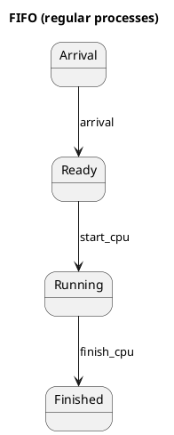
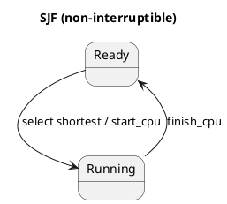
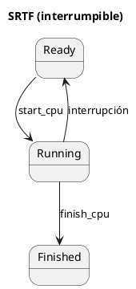
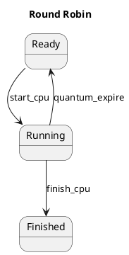
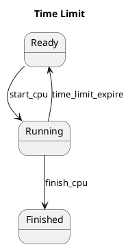
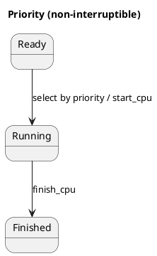
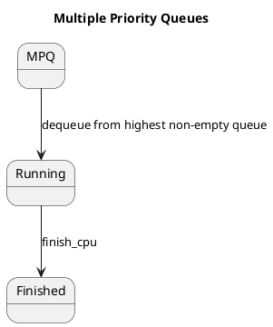
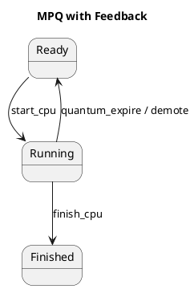

## Diagramas de estado

En esta sección se presentan los diagramas de estado que definen el comportamiento de los procesos dentro del simulador MASO, en función del algoritmo de planificación seleccionado. Cada algoritmo se describe como un autómata de estados finito en el que las transiciones dependen de eventos como: llegada de procesos/hilos, inicio y finalización de ráfagas (CPU / I/O), interrupción, expiración de quantum y cambios de contexto.

Se incluyen:

- Estados comunes: Ready (listo), Running (ejecutando), Waiting (bloqueado en I/O), ContextSwitch (cambio de contexto), Idle (CPU libre), Finished (finalizado).
- Eventos: arrival (llegada de proceso/hilo), start_cpu, finish_cpu, start_io, finish_io, interrupción, quantum_expire, context_switch_start, context_switch_end.

Nota: los algoritmos implementados en MASO cubren variantes no interrumpibles (FIFO, SJF, Priority, Multiple Priority Queues, MPQ con feedback - por slices) y que permiten la interrupción (SRTF, Round Robin, Time Limit). Para procesos tipo "burst" (con hilos y ráfagas CPU/I/O) se emplean colas separadas para CPU e I/O y estados equivalentes por hilo.

### Interfaz (inputs / outputs / criterios)

Esta subsección define de forma concisa la interfaz del servicio de planificación: qué datos requiere (inputs), qué produce (outputs) y qué criterios se usan para considerar que la ejecución es correcta. Se usa como contrato técnico para facilitar revisiones, pruebas automatizadas y para dejar explícitos los supuestos que deben cumplirse antes de ejecutar los algoritmos en MASO.

- Inputs: lista de procesos (RegularProcess o BurstProcess), `ExecutionSetup` (nº CPUs, nº canales I/O, quantum, timeLimit, contextSwitchTime, modo de procesos).
- Output: estructura `Machine` con la línea de tiempo de cada CPU e I/O (componentes `HardwareComponent` con estados: free, busy, switchingContext).
- Criterio de éxito: el diagrama y descripción permiten reconstruir el comportamiento observando las transiciones principales implementadas en las clases de servicio.

### Estados y semántica

- Idle / Free: la CPU o canal I/O no tiene trabajo. En el código se representa con `HardwareState.free` y se modela como ráfagas ficticias `freeProcess`.
- Busy / Running: ejecución de una ráfaga de CPU o I/O por un proceso/hilo (`HardwareState.busy`).
- ContextSwitch / SwitchingContext: periodo de cambio de contexto entre procesos (`HardwareState.switchingContext`).
- Ready: proceso/hilo está en cola listo para ejecutarse (no se materializa directamente en `HardwareComponent`, pero sí en las colas internas como `readyQueue`, `cpuReadyQueue`, etc.).
- Waiting: proceso/hilo se encuentra en espera de I/O; modelado por su presencia en la cola de I/O o por estar en `ioChannels` ocupados.
- Finished: proceso/hilo que ya completó todas sus ráfagas.

### Eventos principales

- arrival: un proceso o hilo entra en sistema. Mueve de no-existente -> Ready.
- start_cpu: el planificador asigna la ráfaga CPU a una CPU -> Ready -> Running.
- finish_cpu: la ráfaga CPU termina -> Running -> Waiting (si sigue con I/O) o -> Finished.
- start_io / finish_io: analógico para ráfagas I/O -> Waiting -> Running(io) -> Ready/Finished.
- interrupción: (SRTF, RR con quantum, TimeLimit) evento que desplaza la ejecución actual -> Running -> Ready (posible ContextSwitch en medio).
- quantum_expire / time_limit_expire: el slice se acaba -> Running -> Ready (o democión en MPQ Feedback).
- context_switch_start / context_switch_end: periodo de cambio de contexto -> Running -> ContextSwitch -> Running (otro proceso) o Idle.

---

## Diagramas por algoritmo (PlantUML)

Nota: los diagramas se presentan en Bloque PlantUML listo para pegar en cualquier herramienta que soporte PlantUML (sitio web de PlantUML, extensiones VSCode, etc.) y exportar a imagen.

En multi-CPU cada CPU sigue un autómata equivalente; la diferencia está en la política de asignación (asignación cíclica simple para FIFO de procesos regulares, asignación a CPUs libres por disponibilidad para sistemas con colas de ráfagas, selección por CPU con menor carga, etc.).

---

### 1) FIFO (First-In, First-Out)

Este algoritmo no permite ser interrumpido una vez que una ráfaga comienza; los procesos se ordenan por llegada y, para procesos regulares, cada proceso se asigna a la siguiente CPU en secuencia (rotación). Para procesos tipo burst se emplea una cola FIFO de ráfagas y se asigna a CPUs libres según disponibilidad.

---

### 2) SJF (Shortest Job First) - no interrumpible

Este algoritmo selecciona la tarea con menor serviceTime entre las que han llegado y no interrumpe una ráfaga en curso.

PlantUML:

---

### 3) SRTF (Shortest Remaining Time First) - interrumpible

Este algoritmo puede interrumpir la ejecución actual si llega otra tarea con menor tiempo restante; siempre ejecuta la ráfaga con menor tiempo restante disponible.

PlantUML:

---

### 4) Round Robin (RR)

Este algoritmo reparte la CPU en slices (quantum) entre procesos; cada proceso ejecuta hasta agotar su slice y, si no termina, se reencola para recibir otro slice posteriormente.

PlantUML:

---

### 5) Time Limit

Este algoritmo es similar a Round Robin, pero el límite temporal por turno se fija por la configuración `timeLimit` en lugar de un quantum fijo.

PlantUML:

---

### 6) Priority (no interrumpible - según implementación)

Este algoritmo ordena los procesos por `priority` (valor menor = mayor prioridad) y, en igualdad de prioridad, por tiempo de llegada; para procesos regulares puede emplear asignación cíclica entre CPUs.

PlantUML:

---

### 7) Multiple Priority Queues (MPQ) - no interrumpible

Este algoritmo mantiene múltiples colas, una por nivel de prioridad; el planificador atiende primero las colas de prioridad más alta, y dentro de cada cola aplica orden FIFO.

PlantUML:

---

### 8) Multiple Priority Queues with Feedback (MPQ Feedback)

Este algoritmo organiza múltiples niveles con democión por consumo de quantum: si un proceso consume su slice completo es enviado a un nivel de prioridad inferior que puede tener un quantum diferente.

PlantUML:

---
